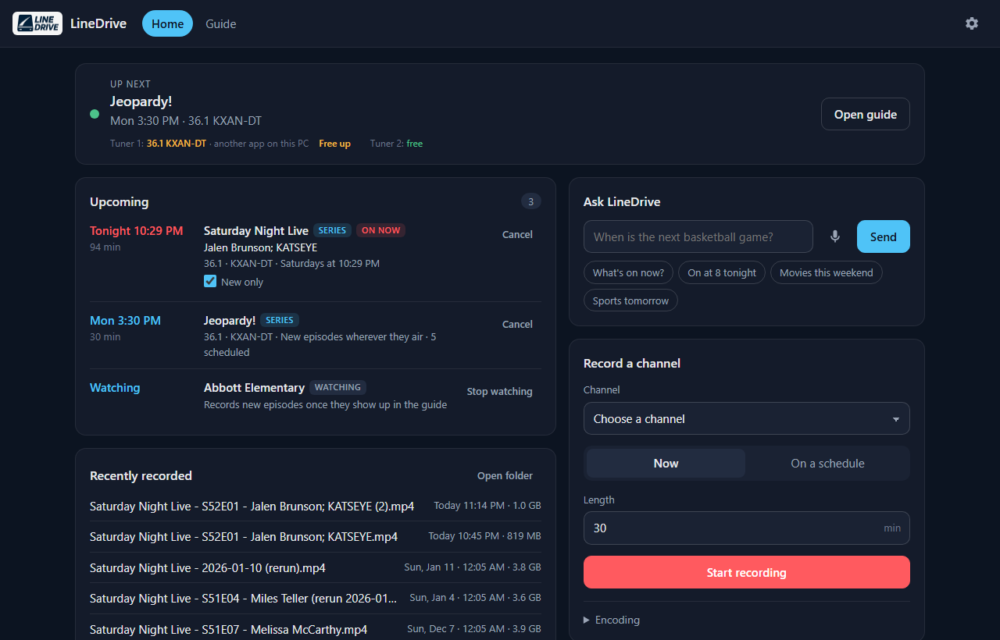
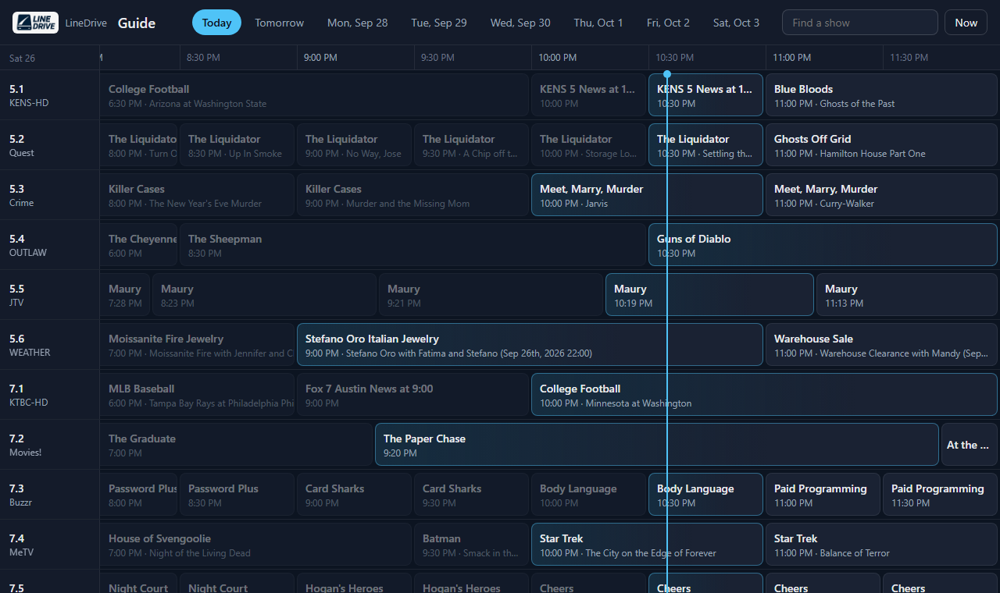
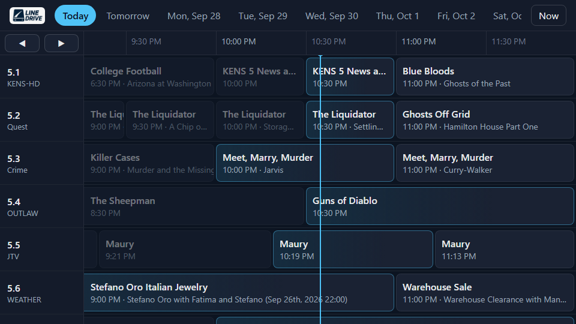
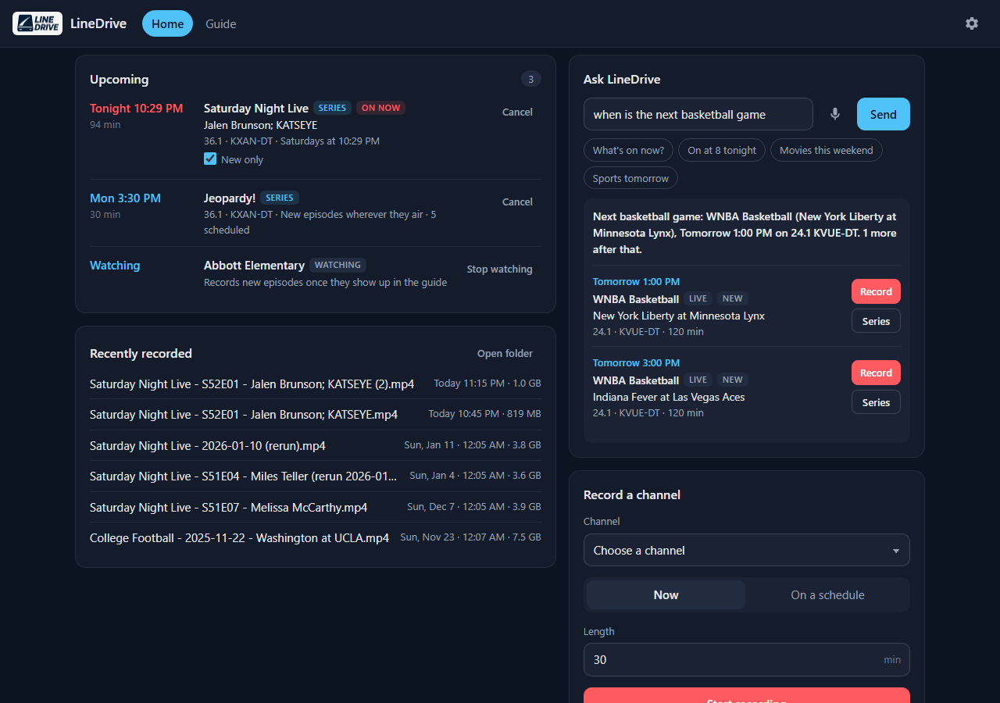
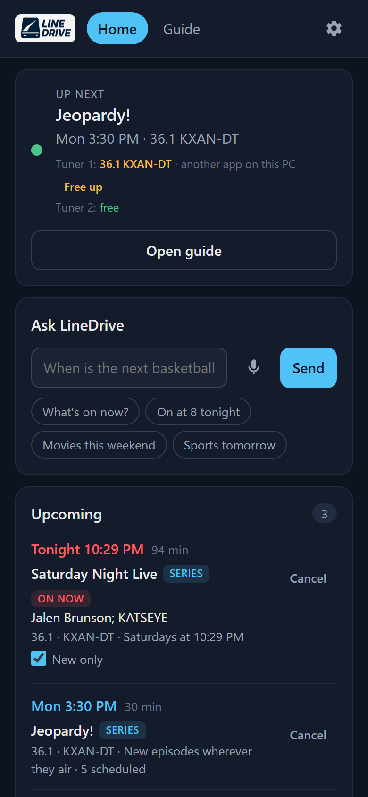

<p align="center">
  
</p>

<h1 align="center">LineDrive</h1>

<p align="center">A self-hosted DVR for HDHomeRun tuners: a real program guide, one-tap and series recording,<br>
plain-English questions ("when's the next basketball game?"), and recordings your media server understands.</p>

<p align="center">
  <a href="https://github.com/HansDandle/LineDrive/actions/workflows/tests.yml"></a>
  <a href="https://github.com/HansDandle/LineDrive/pkgs/container/linedrive"></a>
  <a href="LICENSE"></a>
</p>



## What it does

- **Program guide.** A week of over-the-air listings for your ZIP code, laid out channel by time, with a now-line, search, and a details panel for each show. Works on phones and has a **TV mode for Fire TV / Silk** (D-pad navigation, rewind/fast-forward to page through time).
- **Record anything, three ways.** Tap a show in the guide, type a channel and length, or just ask.
- **Ask LineDrive.** Questions and commands in plain English, answered from the guide, offline, no AI service:
  - "when's the next basketball game?" · "what's on NBC at 9?" · "is Jeopardy on tomorrow?" · "movies this weekend"
  - "record the next Longhorns game" · "record SNL every Saturday" · "record Jeopardy, new episodes only"
  - "record Abbott Elementary when it comes back" (it watches the guide and starts recording when the new season shows up)
- **Series that don't waste tuners.** "New episodes only" follows each first-run episode wherever it airs (preemptions, sister stations), skips reruns, and skips episodes you already have.
- **Recordings your media server understands.** `TV/<Show>/Season 52/Show - S52E01 - Episode Title.mp4` (or air-date names), `Movies/<Title (Year)>/`, plus a `.nfo` with the plot and air date and a `.srt` of the broadcast's closed captions. Jellyfin, Emby, Kodi and Plex pick them up with proper titles and subtitles.
- **Tuner-aware.** Refuses to "record" when every tuner is busy (and tells you who has them), reports failed recordings, and has a **kill switch** for streams other apps leave open (hello, Jellyfin live TV).
- **Integrations (all optional):**
  - **Jellyfin:** new recordings appear seconds after they finish.
  - **Jellyseerr:** "download Dune" or "get season 2 of The Bear" sends a request to Radarr/Sonarr.
  - **Home Assistant:** a LineDrive device with status, next recording, tuners free and last failure sensors, plus Stop and Free tuner buttons, via MQTT auto-discovery.

| Guide | Fire TV mode | Ask LineDrive | Phone |
|---|---|---|---|
|  |  |  |  |

## Compatibility

- **Any number of tuners.** LineDrive reads the tuner count from the device: DUO, QUATRO, FLEX 4K, SCRIBE and so on. Each recording takes whichever tuner is free.
- **One HDHomeRun at a time** for now. Several devices on one network aren't combined yet.
- **ATSC 1.0 channels** are what it's tested on. On ATSC 3.0 (NextGen TV) tuners such as the FLEX 4K, DRM-protected 3.0 stations can't be recorded by any third-party app, and unencrypted 3.0 stations are untested (their AC-4 audio may not decode in FFmpeg). The ATSC 1.0 simulcasts of the same stations work normally.

## Quick start (Docker)

```yaml
# docker-compose.yml
services:
  linedrive:
    image: ghcr.io/hansdandle/linedrive:latest
    container_name: linedrive
    environment:
      - TZ=America/New_York        # your time zone
    volumes:
      - ./config:/config
      - ./recordings:/recordings
    ports:
      - "5050:5050"
    restart: unless-stopped
```

```sh
docker compose up -d
```

Open `http://<your-server>:5050`. The first visit takes you to **Settings**: pick your HDHomeRun (it's found automatically on most networks), enter your ZIP code, and you're done.

Images are built for **amd64 and arm64** (Raspberry Pi 4/5, most NASes).

> **Auto-discovery in Docker:** on Linux, add `network_mode: host` (and drop `ports:`) so the setup page can broadcast for tuners. Otherwise just type the tuner's IP; it's in the HDHomeRun app or your router's device list.

## Quick start (without Docker)

Needs Python 3.10+ and [FFmpeg](https://ffmpeg.org/download.html) on your PATH. Works on Windows, macOS and Linux.

```sh
git clone https://github.com/HansDandle/LineDrive.git
cd LineDrive
pip install -r requirements.txt
python dvr_web.py
```

Then open `http://localhost:5050` and follow the setup page.

## How it works

**The guide** comes from two free sources. Gracenote's over-the-air listings for your ZIP code (the same data behind TV-listing sites) cover a week. SiliconDust's own guide for your tuner, the one the HDHomeRun app uses, covers about a day ahead and adds series IDs, original air dates (better rerun detection), artwork, and channels Gracenote doesn't list. **Outside the US**, leave the ZIP code empty and the guide comes from SiliconDust alone. Channels your antenna doesn't get aren't shown; if it picks up a neighboring city, mark those stations "out of market" in Settings and LineDrive prefers local ones.

**Recording** pulls the tuner's HTTP stream and encodes it to H.264 MP4 with FFmpeg (CPU encode). **Settings → Recording quality** trades size for quality: Best, Standard (about 2.5 GB an hour of full-HD TV), Smaller, 720p (about 0.9 GB an hour and much lighter on the CPU, a good pick for a Raspberry Pi or several recordings at once), or Original (the untouched broadcast as `.ts`). Each recording is named from the listing on air when it starts, and it's a fragmented MP4, so a recording cut off by a crash or power cut still plays up to that point.

**Restarts don't lose recordings.** If LineDrive restarts partway through a show (an update, a reboot, a settings change), it picks the recording back up and records the rest as `<name> (2).mp4`. It also starts anything it missed while it was off, if the show is still on.

**Signal strength.** LineDrive checks every channel's signal on a spare tuner (weekly, or from **Settings → Check signal**) and while you watch or record. The guide shows bars next to each channel and warns before you record a weak one.

**Series** come in two flavors:

| | Time-slot series | New episodes only |
|---|---|---|
| Records | every airing in that slot ("Saturdays 10:29 PM on 36.1") | each new episode, wherever and whenever it's listed |
| Reruns | recorded, unless you flip its **New only** switch | skipped |
| Episodes you already have | skipped | skipped |
| Good for | news, live shows, anything with a fixed slot | syndicated and network shows that move around |

"Already have it" is checked against your recordings folder by season/episode number or episode title, so a wrong "new" flag in the guide won't cost you a tuner.

**Reliability details:** a recording that follows live sports on the same channel gets 30 extra minutes, because games run long and push everything after them back (`recording.sports_overrun_minutes`); a recording starts even if LineDrive was briefly late (within 5 minutes), two copies of LineDrive can't both run the same schedule, clashing file names get ` (2)` instead of overwriting, and a recording that can't get a tuner shows up on the status card (and in Home Assistant) instead of failing silently.

## Settings

Everything is on the **Settings** page (gear icon). It writes `config.json` in the config folder; [`config_template.json`](config_template.json) documents every option.

| Setting | Notes |
|---|---|
| HDHomeRun | Found automatically, or type its IP. |
| ZIP code | US: a week of Gracenote listings. Leave empty elsewhere (SiliconDust's guide, about a day ahead). |
| Recording quality | Best / Standard / Smaller / 720p / Original. |
| Time zone | Leave on "this computer's". In Docker, set `TZ`. |
| Recordings folder | `/recordings` in Docker. |
| Out-of-market stations | Stations from another city your antenna also receives. |
| Jellyfin | URL + API key (Dashboard → API Keys). Set *Recordings folder as Jellyfin sees it* to the path the recordings are mounted at inside Jellyfin. |
| Jellyseerr | URL + API key (Settings → General). |
| Home Assistant | Your MQTT broker. The LineDrive device appears on its own. |

### Jellyfin / Plex

Point a **TV Shows** library at `<recordings>/TV` and a **Movies** library at `<recordings>/Movies`. Jellyfin, Emby and Kodi read the `.nfo` files; Plex matches by the file names.

Docker on Windows or macOS doesn't pass file-change events into containers, so Jellyfin won't notice new files on its own there. Give LineDrive a Jellyfin API key and it asks Jellyfin to rescan as each recording finishes.

### Home Assistant

With MQTT set up, LineDrive shows up as a device:

| Entity | |
|---|---|
| `sensor.linedrive_status` | Recording / Idle (attributes: current show, tuners, what's being watched for…) |
| `binary_sensor.linedrive_recording` | on while recording |
| `sensor.linedrive_now_recording`, `sensor.linedrive_next_recording`, `sensor.linedrive_next_recording_time` | |
| `sensor.linedrive_tuners_free` | |
| `sensor.linedrive_last_failure` | handy as a notification trigger |
| `button.linedrive_stop_recording`, `button.linedrive_free_tuner_N` | |

## Troubleshooting

- **"All tuners are in use."** Another app (Jellyfin/Plex live TV, the HDHomeRun app, Channels) has them. The status card shows what's on each tuner; **Free up** releases one another app left open. In Jellyfin, setting the tuner's simultaneous-stream limit to 1 keeps a tuner free for LineDrive.
- **Guide is empty.** Check the ZIP code with **Test** in Settings. Outside the US, leave it empty.
- **Times are off by an hour or more.** In Docker, set `TZ`. Otherwise leave Time zone on "this computer's".
- **Can't reach `http://<this PC's IP>:5050` from the same Windows PC** (other devices work): that's Docker Desktop with WSL "mirrored" networking. Use `http://localhost:5050` on that PC, or add `hostAddressLoopback=true` under `[experimental]` in `%UserProfile%\.wslconfig`.
- **Recordings have blocky glitches.** That's reception: the damage is in the broadcast LineDrive received. The guide's signal bars show which channels are weak; **Check now** in a show's details re-measures one.

## Security

LineDrive has no login. Run it on your home network only. Don't port-forward it to the internet; use a VPN (Tailscale, WireGuard) if you want remote access.

## Development

```sh
pip install -r requirements.txt pytest
pytest
```

The tests use a fixed week of real listings (`tests/fixtures/guide_sample.json`) and don't need a tuner. See [CONTRIBUTING.md](CONTRIBUTING.md).

| File | What it is |
|---|---|
| `dvr_web.py` | web app, scheduler, recorder |
| `ask_engine.py` | offline question answering over the guide |
| `epg_zap2it.py` | guide download and parsing |
| `hdhomerun_control.py` | tuner discovery and the control protocol (kill switch) |
| `media_requests.py` | Jellyseerr requests |
| `mqtt_bridge.py` | Home Assistant integration |

## Legal

LineDrive records free over-the-air broadcasts you're entitled to receive, for personal time-shifting. You're responsible for how you use it; see [LEGAL.md](LEGAL.md).

LineDrive is an independent project, not affiliated with or endorsed by SiliconDust. **HDHomeRun** is a trademark of SiliconDust USA Inc. Guide data is © Gracenote. See [TRADEMARK_NOTICE.md](TRADEMARK_NOTICE.md).

MIT licensed.
